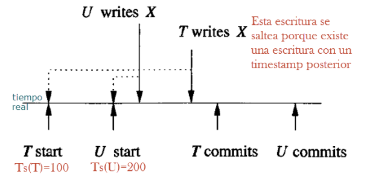
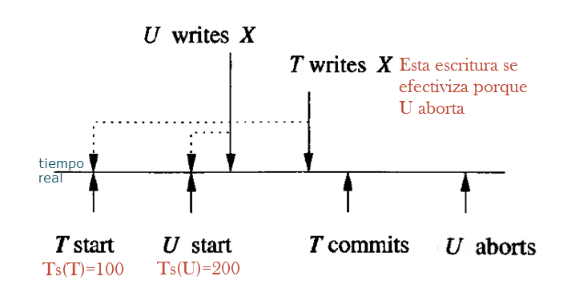

# Clase 5

# Modelo optimista

**Enfoque:** Estos métodos asumen que no ocurrirá un comportamiento no serializable y actúan para reparar el problema sólo cuando ocurre una violación aparente.

**Timestamp:(TS(T))** **Número de marca** asignado de forma ascendente y único para cada transacción. El scheduler tiene una tabla de transacciones y sus _timestamps_. El scheduler mantiene una **tabla** con las transacciones y sus timestamps; este también maneja la ejecución concurrente de manera que los timestamps determinan el **orden de serialización**.

Cada elemento (ítem de la base de datos en una celda) X se asocia a 2 timestamps y un bit extra:

- **RT(X):** (Read-Timestamp) Tiempo de lectura, el timestamp **más alto** de una transacción que **haya leído X**. 

- **WT(X):** (Write-Timestamp) Tiempo de escritura, el timestamp **más alto** de una transacción que **ha escrito X**.

- **C(x):** (Commit) Bit de commit para X, es verdadero sii la transacción más **reciente** que **escribió X ha realizado un commit**.

**Fisicamente irrealizable:** 

- **Read Too Late:** (T comienza ; W escribe X ; T lee X -> T debe abortar si TS(T) < TS(W)) 
  - TS(T) < WT(X)
  - Una transacción T intenta leer X pero el valor de escritura indica que X fue escrito después de que teóricamente debería haberlo leído T.
  
- **Write Too Late:**
  - WT(X) < TS(T) < RT(X)
  - T intenta escribir pero el tiempo de lectura de X indica que alguna otra transacción debería haber leído el valor escrito por T (lee otro valor en su lugar).

**Dirty data:** Una lectura sucia ocurre cuando se le permite a una transacción la lectura de un elemento que ha sido modificado por otra transacción concurrente pero que todavía no ha sido cometida (commit).

**Thomas write rule:** La escritura puede “saltearse” cuando ya existe una escritura de una transacción con un timestamp de mayor valor. Es decir cuando WT(X) > TS(T). 

## Reglas para el scheduler:
- Conceder la solicitud.
- Abortar y reiniciar T con un nuevo timestamp (rollback).
- Demorar T y decidir luego si abortar o conceder la solicitud (si el requerimiento es una lectura que podría ser sucia).

### Recibe una solicitud de lectura rt(X)

**Caso 1:** Si TS(T) >= WT(X) - es **físicamente realizable** es decir, no sucede read too late.

- Si C(X) es True, conceder la solicitud. Si TS(T)>RT(X) hacer RT(X)=TS(T), de otro modo no cambiar RT(X).
- Si C(X) es False demorar T hasta que C(X) sea verdadero o la transacción que escribió a X aborte.

**Caso 2:** Si TS(T) < WT(X) - es físicamente irrealizable (**read too late**).

- Se hace Rollback T (abortar y reiniciar con un nuevo timestamp).

### Recibe una solicitud de escritura wt(X)

**Caso 1:** Si TS(T) >= RT(X) y TS(T) >= WT(X) - es físicamente realizable, es decir, no sucede write too late.

- Escribir el nuevo valor para X.
- WT(X) := TS(T), o sea asignar nuevo WT a X.
- C(X):= false, o sea poner en falso el bit de commit.

**Caso 2:** Si TS(T) >= RT(X) pero TS(T) < WT(X) - es físicamente realizable, pero ya hay un valor posterior en X.

- Si C(X) es true, ignora la escritura.
- Si C(X) es falso demorar T hasta que C(X) sea verdadero o la transacción que escribió a X aborte.

**Caso 3:** Si TS(T) < RT(X) - es físicamente irrealizable, es decir, write too
late.

- Se hace Rollback T (abortar y reiniciar con un nuevo timestamp).

# Protocolos multiversión

**Timestamping multiversión:**
- Variación/Extensión del planificadores monoversión
- Mantiene versiones históricas de los items
- Permite que las transacciones lean valores antiguos
- Evita aborts ocasionados por eventos read-too-late

**Lectura y escritura:** Una operación de lectura de la forma r (x) lee una versión existente de x, y una operación de escritura de la forma w (x) (siempre) crea una nueva versión de x o sobrescribe una existente.  

