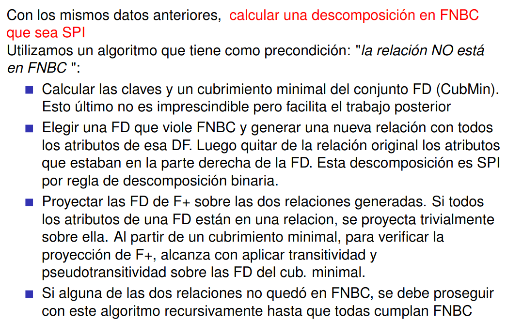
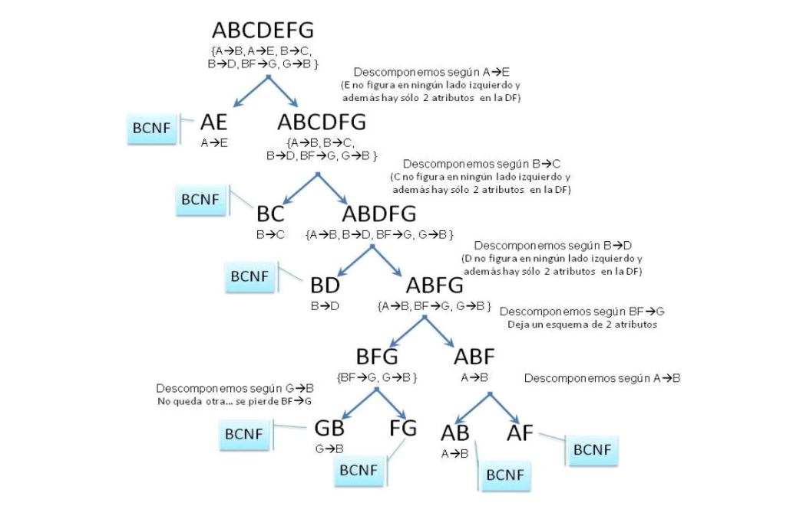

# Resumen Primer Parcial 

## Elementos de un DER (Diagrama Entidad Relación, es una representación gráfica de un MER)

- **Entidades:** Cosas que queremos modelar (Fuertes o débiles).

- **Atributos:** Información de una entidad (Simples o identificatorios(PK)). Tiene una PK por cada entidad mínimo y pueden haber atributos multivaluados (conjunto de valores para una entidad).

- **Interrelaciones:** Asociacion entre entidades. Hay que tener en cuenta:
  
  - **Grado:** Catidad de entidades que participan en ella (unaria(aclarar roles), binaria, ternaria, etc.).
  
  - **Cardinalidad:** Cantidad de elementos de un rol de la interrelacion que se vinculan a otro (1:1, 1:n, n:m).
  
  - **Participación:** Elementos de una entidad que participan en una interrelación (total o parcial). Las entidades débiles siempre tienen participación total a la fuente de la que depende.
  
  - **Atributos en Interrelaciones:** Tanto simples como identificatorios son permitidos en **n:m**.
  
  - En interrelaciones ternarias se lee de a pares con respecto de la cardinalidad y el significado.
  
- **Jerarquías:** Es para modelar entidades particulares a otras entidades. Las propiedades del padre se heredan al hijo.

  - **Cobertura Parcial:** Algún elemento de la superentidad podría no estar en la subentidad.
  
  - **Cobertura total:** Todo elemento de la superentidad debe estar en la subentidad.

  - **Jerarquía Disjunta:** Un elemento de la superentidad está en a lo sumo en una subentidad.

  - **Jerarquía con solapamiento (overlapping):** Puede estar en más de una subentidad.
  
- **Agregaciones:** Son para representar una interrelacion donde participan otras interrelaciones. Es una abstracción en la cual una interrelación es tratada como una entidad de alto nivel. Solo en relaciones N:M.

- **Restricciones adicionales:** Todo lo que no se puede deducir del DER ni modificandolo y se quiere como restricción.

## De MER a MR

El MER se utiliza para un diseño conceptual cuando el MR para un diseño lógico. 

- **Entidades básicas:** Se vuelve la entidad un esquema donde su nombre para a el nombre de la relación y sus atributos pasan como los atributos. Entidad(attr1, attr2, ..., attrN).

- **Entidades con atributos compuestos:** Se descompone el compuesto y se toma como en las entidades básicas.

- **Atributos multivaluados:** Se crea un esquema con el nombre del atributo como nombre de relación y las PK es la PK de la entidad de la que dependía (esta también es FK) sumandole una PK que se asocia con otra más que representa lo que iba a tener de contenido este atributo antes.

- **Entidades débiles:** Se le suma como FK y parte de la PK la clave de la identidad fuerte de la que depende.

- **Interrelaciones(1:1):** Se incorpora la PK de una de las entidades como FK de la otra entidad (toma prioridad la que no tenga participación parcial).
  
- **Interrelaciones(1:n):** Incorpora la PK de la entidad uno en la entidad muchos como FK.

- **Interrelaciones(n:m):** La interrelación se vuelve un esquema donde su PK es la combinación de las PK de las entidades que relaciona y la PK de la interrelación si es que tiene, su FK son a las PKs de las entidades.

- **Interrelaciones unarias:** Se agrega una FK que indica la relación unaria.

- **Interrelaciones ternarias:** Una por cada entidad y una por la interrelación
  
  - **Interrelación ternaria(1:1:1):** Se elige una PK para la relación de la interrelación tal que puede ser la combinación de 2 de las PK de las entidades que participan.
  
  - **Interrelación ternaria(1:1:n):** Lo mismo pero se reduce las CK a las que tienen la PK de la cardinalidad N.
  
  - **Interrelación ternaria(1:n:m):** Solo hay una CK que es la combinación de las PK que tienen las entidades con n y m.

  - **Interrelación ternaria(n:m:p):** Se usa como PK una tupla con las PK de las 3 entidades.
  
- **Jerarquías:** Un esquema para la superentidad y para cada subentidad.
  
  - **Jerarquía disjunta:** Se agrega el atributo tipo en el esquema de la superentidad que permite particionar el conjunto de subentidades. Las subentidaddes tienen a la PK de la superentidad como PK y FK.
  - **Jerarquía con solapamiento:** No se agrega ningun atributo a la superentidad.

- **Agregación:** Similares a las de las interrelaciones binarias. Pero a la interrelación fuera de la agregación se la trata como una "binaria" con la relación que se genera de la interrelación dentro de la agregación.

## Lenguajes

## Normalización

### Introducción - MR
- **Dominio:** Conjunto de valores atómicos.

- **Esquema de la relación:** R(A 1, A2, ..., An) combre de relación R y un conjunto de atributos.

- **Aridad:** Cantidad de atributos que tiene una relación.

### Dependencias funcionales
- **Determinar funcionalmente:** (LU -> Nombre) Sea X -> Y sucede que si el valore en una instancia de la relación es el mismo que en otra intancia, entonces en ambas instancias de la relación Y es el mismo valor.

- **Inferencia:** Sean F y G conjuntos de dependencias funcionales, decimos que F infiere a G si podemos deducir las dependencias funcionales de G a partir de F.

- **Axiomas de Amstrong:**

  - **Reflexividad:** Si Y \subseteq X entonces X -> Y. Por lo cual se cumple que X -> X.
  
  - **Aumento:** Para cualquier W, si X -> Y entonces XW -> WY.
  
  - **Transitividad:** Si X -> Y e Y -> Z entonces X -> Z.
  
- **Reglas adicionales:** (Se demuestran aplicando los axiomas)
  
  - **Unión:** Si X -> Y y X -> Z entonces X -> YZ.
  
  - **Pseudotransitividad:** Para cualquier W, si X -> Y e YW -> Z entonces XW -> Z.
  
  - **Descomposición:** Si X -> YZ entonces X -> Y y X -> Z.

- **Clausura de F (F+):** Conjunto de **todas** dependencias funcionales que pueden inferirse del mismo aplicando los axiomas.  
  F+ = {X -> Y/ F infiere (X -> Y)}

- **Clausura de conjunto de atributos:** Conjunto de todos los atributos A que X -> A, o sea:  
  X+ = {A \in R / F infiere X -> A} 

  Una forma de calcular X+ es computar una secuencia de conjuntos de atributos X_0, X 1, ... aplicando las reglas hasta que te quede siempre el mismo conjunto sobre el conjunto que generaste.

- **Superclave:** X es **superclave** de R sii X -> R \in F+.

- **Clave:** Conjunto minimal de atributos tal que determina toda la relación. Sea X superclave de R, si no existe ningún Z \subset X tal que Z -> R \in F + entonces X es clave de R (no hay una superclave más chica que esta).

- **Propiedad de la clausura:** Dados F y X -> Y, luego F infiere (X -> Y) sii Y \subseteq X+. Si X+ = R entonces X es superclave de R.

- **Equivalencia de conjuntos de dependencias funcionales:** F y G son equivalentes si F+ = G+ (también si F infiere a G y G a F, o sea si F cubre G y G cubre F).

- **Cubrimiento minimal:** Conjunto de dependencias funcionales F es un conjunto de dependencias Fm tal que Fm \equiv F y además Fm cumple:
  
  - Todo lado derecho tiene un único atributo (con la regla de descomposición se consigue).
  
  - Todo lado izquierdo es reducido (no tiene atributos redundantes) (B \subset X es redundante para X -> A si A \in (X - {B})+).

  - No contiene dependencias funcionales redundantes (en general son las que se obtienen por transitividad).  X -> A es redundante si (F - {X -> A}) \equiv F.  
  
  Puede haber varios cubrimientos para un mismo conjunto de dependencias funcionales F.

### Anomalías y Descomposición
- Problemas/anomalías que se pueden presentar en un esquema y las posibles soluciones:
  
  - **Redundancia de información:** Se repite en una instancia la misma información.
    
  - **Anomalías de actualizción:** Tener que cambiar un dato de varias tuplas si se cambia algo
    
  - **Anomalías de inserción:** Tener que usar null para valores de tuplas porque no se tienen todos los datos para inicializar la tupla completa.
    
  - **Anomalías de borrado:** Si queremos borrar un dato particular de una entidad tenemos que borrar toda la tupla y esto puede traer problemas.

- **Descomposición:** Dividir un esquema en varios subesquemas de manera que TODOS los atributos del esquema esten presentes en al menos un subesquema.
  
- **lossless join:** (en descomposición binaria) Lo es sii   
  (R1 \intersection R2) -> (R1 - R2) está en F+ ó   
  (R2 \intersection R1) -> (R2 - R1) está en F+  

  Si la intersección forma una superclave para alguno de los dos esquemas entonces es SPI la tupla (R1, R2).

- **Algoritmo de TABLEAU** (Para ver lossless join en más que descomposición binaria) Se termina cuando no se pueden hacer más cambios en la tableau final (T*) aplicando las dependencias funcionales. Si T* contiene una fila con todos los símbolos distinguidos entonces el esquema es SPI.

  

  En cierto grado esto te da la intuición de cómo se pasa de una T a otra.

- **Perdida de dependencias funcionales:** (**SPDF** es descomposición sin pérdidas de dependencias funcionales) 

- **Proyección de un conjunto DF:** Decimos que la proyección de un conjunto de dependencias funcionales F sobre un conjunto de atributos Z, que se escribe piZ(F), es el conjunto de dependencias funcionales X -> Y \in F+ tal que XY \subseteq Z.

- **Algoritmo para testear perdidas de dependencias**
  
  

### Formas Normales
Conjunto de propiedades para los esquemas de relación para los esquemas de relación sobre un conjunto de dependencias funcionales. Las formas normales nos permiten evitar las anomalías que mencionamos anteriormente. Las más importantes son la tercera forma normal y la forma normal de Boyce-Cood.  
Nos dan un piso para el proceso de descomposición.

- **Atributos primos:** Decimos que un atributo es primo si es miembro de alguna clave candidata. Si no, decimos que no es primo(?.

- **Dependencia funcional total/parcial:** X -> Y es parcial si algún subconjunto Z \subset X, se verifica que Z -> Y. En caso contrario decimos que la dependencia funcional es total. 

- **Primera Forma Normal:** Evitar que haya atributos multivaluados o compuestos. Todos sus atributos deben ser atómicos (por nuestra def de relación del MR todas las relaciones cumplen esto).

- **Segunda Forma Normal:** Un esquema de relación R está en 2FN sii todo atributo no primo A en R no es parcialmente dependiente de alguna clave de R.

- **Tercera Forma Normal:** Para toda dependencia funcional no trivial (A no es un subconjunto de X) X -> A sobre R, se cumple que:
  
  - X es superclave de R ó
  
  - A es primo

- **Forma Normal de Boyce-Codd (FNBC)** Para toda dependencia funcional no trivial X -> A sobre R, X es superclave de R. Lo equivalente a decir que para toda dependencia X -> Y en F+, o bien Y \subseteq X ó X es una superclave de R.

  
  

- **Propiedades de las Formas Normales:**
  

- **Algoritmo de descomposición SPI y SPDF en 3FN**
  
  
  
 